# 流程圖

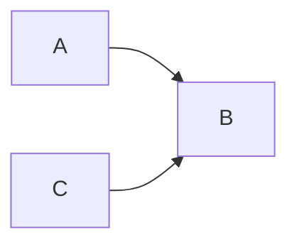
```mermaid

flowchart LR

A --> B

C--> B

```

# 時序圖

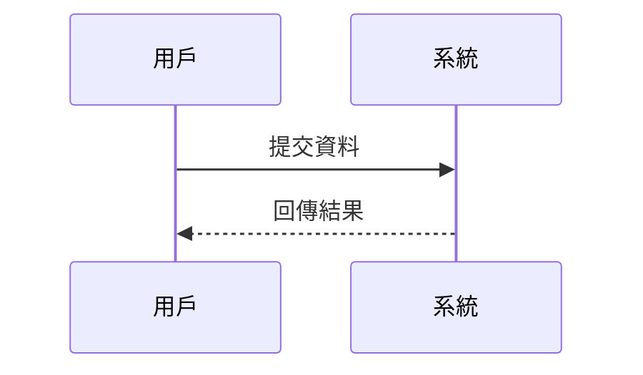
```mermaid
sequenceDiagram
    participant 用戶
    participant 系統
    用戶->>系統: 提交資料
    系統-->>用戶: 回傳結果
```

# 圓餅圖

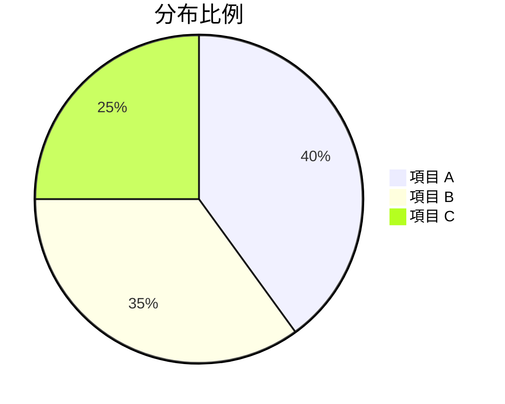
```mermaid
pie title 分布比例
    "項目 A" : 40
    "項目 B" : 35
    "項目 C" : 25
```

# 甘特圖

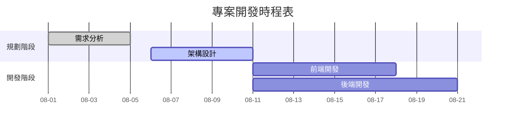
```mermaid
gantt
    title 專案開發時程表
    dateFormat  YYYY-MM-DD
    axisFormat  %m-%d
    
    section 規劃階段
    需求分析       :done,    des1, 2026-08-01, 2026-08-05
    架構設計       :active,  des2, 2026-08-06, 5d
    
    section 開發階段
    前端開發       :         dev1, after des2, 7d
    後端開發       :         dev2, after des2, 10d
```

# 狀態圖

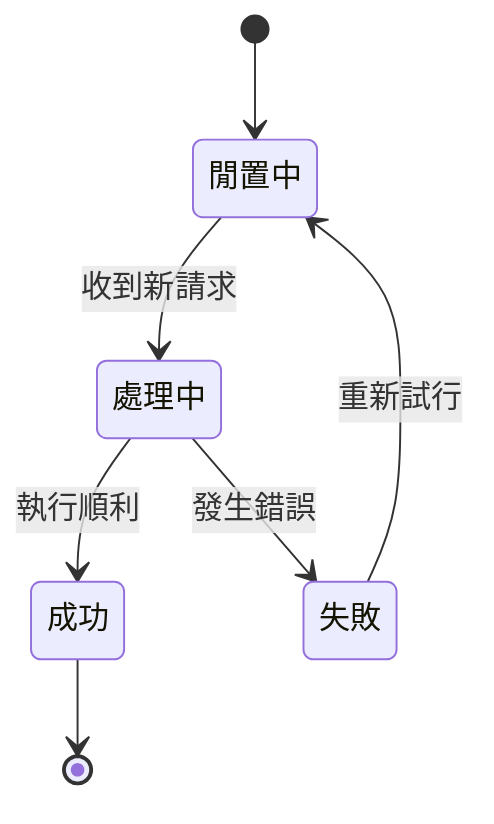
```mermaid
stateDiagram-v2
    [*] --> 閒置中
    閒置中 --> 處理中 : 收到新請求
    處理中 --> 成功 : 執行順利
    處理中 --> 失敗 : 發生錯誤
    成功 --> [*]
    失敗 --> 閒置中 : 重新試行
```

# 類別圖

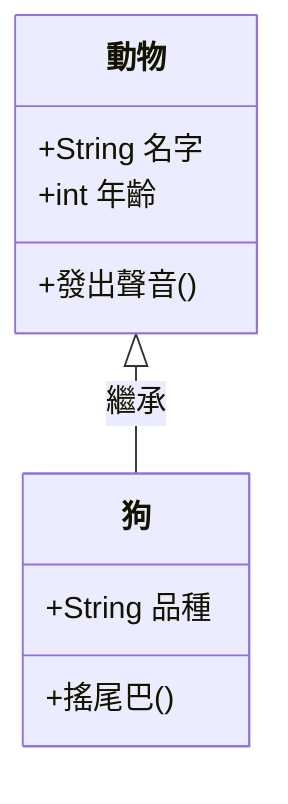
```mermaid
classDiagram
    class 動物 {
        +String 名字
        +int 年齡
        +發出聲音()
    }
    class 狗 {
        +String 品種
        +搖尾巴()
    }
    動物 <|-- 狗 : 繼承
```

# 實體關係圖

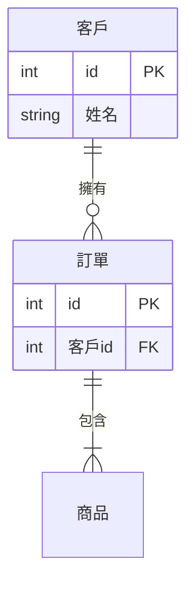
```mermaid
erDiagram
    客戶 ||--o{ 訂單 : 擁有
    訂單 ||--|{ 商品 : 包含
    客戶 {
        int id PK
        string 姓名
    }
    訂單 {
        int id PK
        int 客戶id FK
    }
```

# 使用者旅程圖

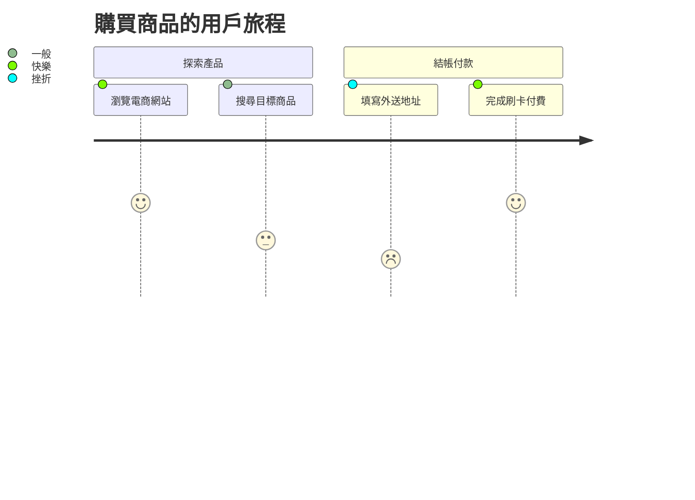
```mermaid
journey
    title 購買商品的用戶旅程
    section 探索產品
      瀏覽電商網站: 5: 快樂
      搜尋目標商品: 3: 一般
    section 結帳付款
      填寫外送地址: 2: 挫折
      完成刷卡付費: 5: 快樂
```

# 四象限圖

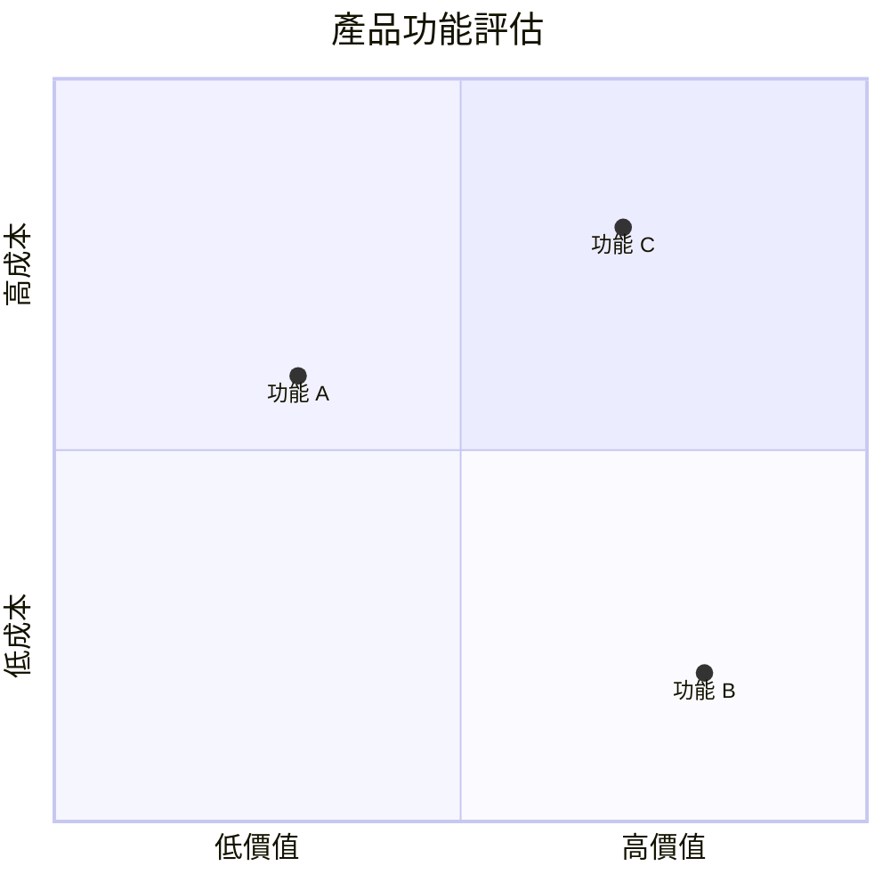
```mermaid
quadrantChart
    title 產品功能評估
    x-axis 低價值 --> 高價值
    y-axis 低成本 --> 高成本
    "功能 A": [0.3, 0.6]
    "功能 B": [0.8, 0.2]
    "功能 C": [0.7, 0.8]
```

# 心智圖

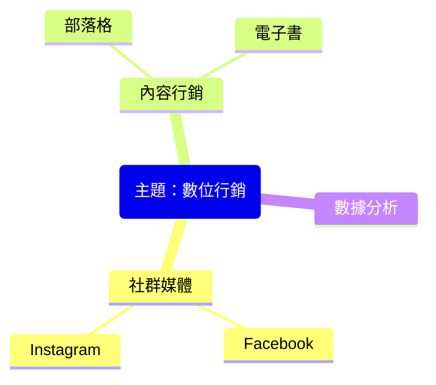
```mermaid
mindmap
    root(主題：數位行銷)
        社群媒體
            Facebook
            Instagram
        內容行銷
            部落格
            電子書
        數據分析
```

# Git 分支圖

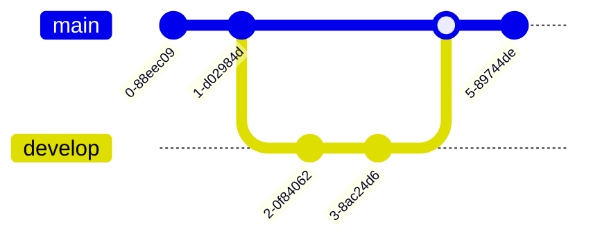
```mermaid
gitGraph
    commit
    commit
    branch develop
    checkout develop
    commit
    commit
    checkout main
    merge develop
    commit
```
